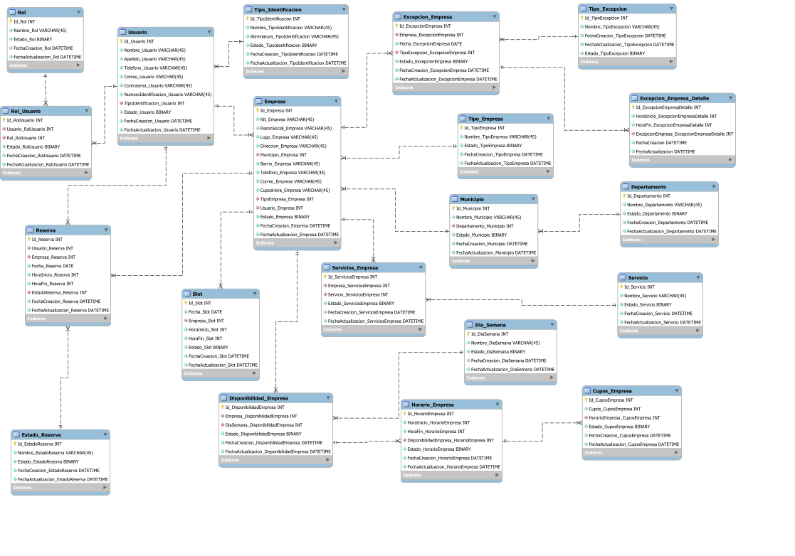

# SISTEMA DE RESERVAS BACKEND - SENATIC_BACK

El proyecto SENATIC_BACK es una API REST desarrollada con Python y Django para gestionar citas y reservas de diferentes empresas u organizaciones. Este proyecto se realiza con el objetivo de dar cumplimiento a la etapa productiva de los estudiantes vinculados a la media técnica por medio del programa SENATIC.

---

## OBJETIVO

Permitir que diferentes empresas publiquen sus servicios y horarios de atención para que los clientes puedan realizar reservas en línea.

---

## TECNOLOGÍAS UTILIZADAS

* Python
* Django
* Django REST Framework
* MySQL
* JWT
* CORS Headers

---

## ARQUITECTURA

El proyecto está organizado por módulos para facilitar su mantenimiento y escalabilidad.

```text
API_REST_RESERVAS/
APLICACION_RESERVAS/
```

---

## ESTRUCTURA DEL PROYECTO

```text
sistema-reservas-backend
│
├── API_REST_RESERVAS
├── APLICACION_RESERVAS
├── DOCS
├── requirements.txt
├── .env.example
├── README.md
└── manage.py
```

---

## MODELO RELACIONAL

<p align="center">
    
</p>

---

## INSTALACIÓN

Clonar el repositorio:

```bash
git clone URL_DEL_REPOSITORIO
```

Crear entorno virtual:

```bash
python -m virtualenv VIRTUAL_ENV
```

Activar entorno virtual:

Windows:

```bash
.\VIRTUAL_ENV\Scripts\Activate
```

Instalar dependencias:

```bash
pip install -r requirements.txt
```

Ejecutar migraciones:

```bash
python manage.py migrate
```

Iniciar servidor:

```bash
python manage.py runserver
```

---

## VARIABLES DE ENTORNO

Crear un archivo `.env` tomando como referencia el archivo `.env.example`.

Ejemplo:

```env
SECRET_KEY=
DEBUG=True
DB_NAME=
DB_USER=
DB_PASSWORD=
DB_HOST=
DB_PORT=
```

---

## FUNCIONALIDADES

* Gestión de usuarios.
* Gestión de roles y permisos.
* Gestión de empresas.
* Gestión de servicios.
* Gestión de horarios de atención.
* Gestión de reservas.
* API REST.

---

## ESTADO DEL PROYECTO

🚧 En desarrollo.

---

## EQUIPO DE DESARROLLO

Proyecto desarrollado con fines educativos y productivos junto con estudiantes de programación.
